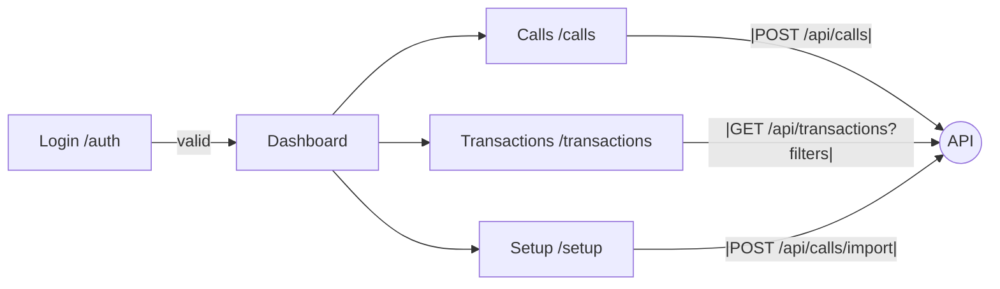
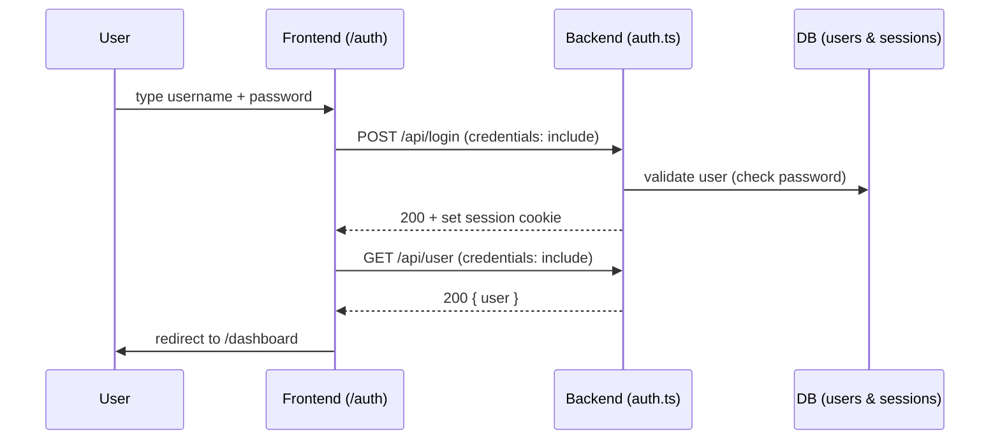
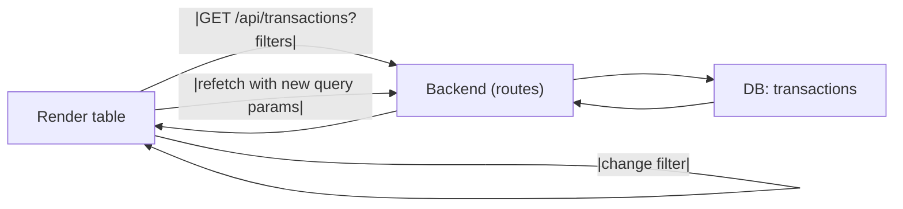

# Cultivasia CRM — Architecture (High Level)

This document maps the main routes, components, API endpoints, and data models.
It helps us debug faster, onboard easier, and stay consistent.

- Last updated by: Edison & [Brother]
- Context: Built on Replit (Agent 3) + GitHub Desktop workflow

---

## Frontend Pages

| Route         | File                              | Purpose                                | Key Components (guess)   |
|---------------|-----------------------------------|----------------------------------------|--------------------------|
| /auth         | client/src/pages/auth-page.tsx    | Login / Authentication screen          | <LoginForm/>             |
| /calls        | client/src/pages/call-list.tsx    | Show all calls, maybe CRUD             | <CallsTable/>, <CallForm/> |
| /dashboard    | client/src/pages/dashboard.tsx    | Main overview with KPIs and shortcuts  | <KpiCards/>, <Sidebar/>  |
| * (fallback)  | client/src/pages/not-found.tsx    | Shown if route doesn’t exist (404)     | –                        |
| /setup        | client/src/pages/setup.tsx        | Initial setup screen (first-time use?) | <SetupForm/>             |
| /transactions | client/src/pages/transactions.tsx | Transactions list + filters            | <TransactionsTable/>, <Filters/> |

---

## Frontend Components (selected)

| Component       | File                              | Purpose                                  | Likely Used By           |
|-----------------|-----------------------------------|------------------------------------------|--------------------------|
| Sidebar         | client/src/components/sidebar.tsx | Left navigation (Monday.com style)       | Dashboard, Transactions, Calls |
| CustomerModal   | client/src/components/customer-modal.tsx | Popup to view or edit customer info | Customers page           |
| UpsellModal     | client/src/components/upsell-modal.tsx | Popup for upsell offers/details         | Upsells page             |
| CsvImport       | client/src/components/csv-import.tsx | Upload CSVs into the CRM (data import)  | Setup page, Admin tools  |
| ui/ (folder)    | client/src/components/ui/         | Generic UI pieces (buttons, inputs, etc) | All pages/components     |

---

## API Endpoints (from server/routes.ts)

### Auth & Middleware
- **requireAuth** → user must be logged in (`req.isAuthenticated()` check)
- **requireAdmin** → user must be logged in **and** have `role: 'admin'`

---

### Products API
| Method | Path              | Purpose               | Needs Auth?       | Notes |
|--------|-------------------|-----------------------|-------------------|-------|
| GET    | /api/products     | List all products     | Yes (requireAuth) | Returns array of products |
| POST   | /api/products     | Create new product    | Yes (requireAdmin)| Validates body with Zod schema |
| PUT    | /api/products/:id | Update product by ID  | Yes (requireAdmin)| Returns 404 if not found |

---

### Calls API
| Method | Path                       | Purpose                 | Needs Auth?       | Notes |
|--------|----------------------------|-------------------------|-------------------|-------|
| GET    | /api/calls                 | List calls (with filters) | Yes (requireAuth) | Filters: `dateFrom`, `dateTo`, `status`, `agentId`, `callType`, `search` |
| POST   | /api/calls                 | Create new call         | Yes (requireAuth) | Rejects duplicates (phone + date) |
| PUT    | /api/calls/:id             | Update call by ID       | Yes (requireAuth) | Partial updates allowed; 404 if not found |
| POST   | /api/calls/:id/assign      | Assign call to agent    | Yes (requireAuth) | Body requires `{ agentId }`; 404 if not found |
| POST   | /api/calls/import          | Import calls from CSV   | Yes (requireAdmin)| Uses `multer` + `Papa.parse`; auto-assigns agents round-robin |

---

### Transactions API
| Method | Path                    | Purpose                      | Needs Auth?       | Notes |
|--------|-------------------------|------------------------------|-------------------|-------|
| GET    | /api/transactions       | List transactions            | Yes (requireAuth) | Filters: `dateFrom`, `dateTo`, `status` (with special cases), `agentId`, `callType`, `search`, `isUpsell` |
| GET    | /api/transactions/:id   | Get transaction by ID        | Yes (requireAuth) | Returns 404 if not found |

---

## Data Models (rough)

*(Based on routes & naming; refine later with actual DB schema)*

### User
- id, email, password_hash, role, created_at

### Call
- id, agent_id, customer_id, outcome, notes, created_at

### Customer
- id, name, phone, email, tags, created_at

### Product
- id, name, description, price, created_at

### Upsell
- id, customer_id, product, amount, created_at

### Transaction
- id, customer_id, agent_id, product_id, amount, status, payment_method, created_at

---

## App Flow (High-Level)

### Auth API (from server/auth.ts)

| Method | Path          | Purpose                          | Notes |
|-------|----------------|----------------------------------|-------|
| POST  | /api/register  | Create user and auto-login       | Requires body: { username, password, ... } |
| POST  | /api/login     | Login via username + password    | Passport LocalStrategy; sets session cookie |
| POST  | /api/logout    | Logout current user              | Destroys session |
| GET   | /api/user      | Get current logged-in user       | 401 if not authenticated |

#### Auth mechanics
- **Auth type**: Session cookie (Passport + express-session)
- **Login check**: `req.isAuthenticated()`
- **Password hashing**: scrypt with salt
- **Serialize/deserialize**: user id stored in session; fetched on each request
- **Frontend requirement**: client must send cookies → `fetch(..., { credentials: 'include' })`
- **Server requirement (CORS)**: must allow credentials (CORS with `credentials: true` and `origin` set to the client URL)

## Server Setup (from server/index.ts)

- Body parsing:
  - `app.use(express.json())`
  - `app.use(express.urlencoded({ extended: false }))`
- Request logging (only for `/api/*`): logs method, path, status, duration, and short JSON response
- Route registration: `registerRoutes(app)` attaches **Auth**, **Products**, **Calls**, **Transactions**, **Dashboard**, etc.
- Error handler: returns `{ message }` with correct status code
- Dev vs Prod:
  - Dev → Vite dev server for client
  - Prod → serves built static client
- Port & host: listens on `PORT` (default `5000`), host `0.0.0.0`
- **Base path**: routes already include `/api/...` (no extra prefix added here)

## Data Models

The CRM uses a Postgres database (via Supabase/Storage) with the following core tables:

### Users
- `id`
- `username`
- `password` (hashed with scrypt + salt)
- `role` (admin, agent, etc.)
- additional profile fields (from insertUserSchema)

### Products
- `id`
- `name`
- `price`
- additional product details

### Calls
- `id`
- `date`
- `phone`
- `status` (new, completed, etc.)
- `agentId` (assigned telemarketer)
- `callType` (confirmation | promo)
- other fields from `insertCallSchema`

### Transactions
- `id`
- `date`
- `customerName`
- `phone`
- `awb` (Air Waybill)
- `orderSku` (product identifier)
- `quantity`
- `currentPrice`
- `shippingFee`
- `address`
- `callType` (confirmation | promo)
- `agentId`
- `status` (new, completed, etc.)
- `isUpsell` (boolean)

### Sessions
- Managed by `express-session` and `storage.sessionStore`
- Stores logged-in `user.id`

## App Flows

### Flow 1 — Login → Dashboard

**Why (in one line):** If login is broken, nothing else works. This flow shows how the user gets authenticated and lands on the app.

**Frontend page(s):**
- `/auth` → `client/src/pages/auth-page.tsx`
- Redirect target: `/dashboard` → `client/src/pages/dashboard.tsx`

**API endpoint(s):**
- `POST /api/login` (logs in; sets session cookie)
- `GET /api/user` (returns current logged-in user)

**Data touched:**
- `users` table (check credentials)
- `sessions` (stores the logged-in user id)

**Steps (plain English):**
1) User opens **/auth** and types username + password.  
2) Frontend sends **POST `/api/login`** with those credentials.  
3) Server checks them, then sets a **session cookie** in the browser.  
4) Frontend calls **GET `/api/user`** to confirm who is logged in.  
5) If it returns 200 + user data → **redirect to `/dashboard`**.  
6) If not, show “Invalid credentials” on the login page.

**Gotchas (things that easily break it):**
- Frontend must include cookies: `fetch(url, { credentials: 'include' })`.  
- Server must allow cookies from the client origin (CORS with `credentials: true`).  
- Frontend must call **`/api/login`** (not `/auth/login` or anything else).  
- After login, frontend should call **`/api/user`** before redirecting.

**Diagram (visual story):**

### Flow 3 — Transactions list + filters

**Why (one line):** Managers/agents use this table every day. If filters or the API call are wrong, the page becomes useless.

**Frontend page(s):**
- `/transactions` → `client/src/pages/transactions.tsx`
- Components likely used: `<TransactionsTable/>`, `<Filters/>`

**API endpoint(s):**
- `GET /api/transactions`  — returns a list (supports many filters)
- `GET /api/transactions/:id` — returns one (used when opening a row detail)

**Accepted query params (filters):**
- `dateFrom` — ISO date string, start of range (e.g., `2025-09-01`)
- `dateTo` — ISO date string, end of range (e.g., `2025-09-30`)
- `status` — e.g., `new`, `completed`, etc. (server has some special cases)
- `agentId` — show records for a specific agent
- `callType` — e.g., `confirmation` or `promo`
- `search` — quick text search (name/phone/sku/etc.)
- `isUpsell` — `true`/`false`

**Data touched:**
- `transactions` table (main source)
- (indirectly) `users` (for agent names), `products` (for SKU/price) — depending on UI joins

**Steps (plain English):**
1) User opens **/transactions**.
2) Frontend builds a URL like:
GET /api/transactions?dateFrom=YYYY-MM-DD&dateTo=YYYY-MM-DD&status=...&agentId=...&callType=...&search=...&isUpsell=...
3) Server reads those query params and fetches matching transactions.
4) Frontend renders the table.
5) When the user changes a filter (date, agent, search):
- Frontend **rebuilds the URL** with the new params
- Calls `GET /api/transactions` again
- Updates the table with the new results

**Gotchas (things that easily break it):**
- Frontend must include cookies on every request (session auth):
- `fetch(url, { credentials: 'include' })` or axios `withCredentials = true`
- Param names must **match exactly** what the API expects (`dateFrom`, not `fromDate`)
- Empty filters should be **left out** of the URL (not sent as `undefined`)
- If results seem wrong, open DevTools → **Network** → check the final request URL and query params

**Example request URLs (just for clarity):**
- `GET /api/transactions?dateFrom=2025-09-01&dateTo=2025-09-30`
- `GET /api/transactions?status=completed&agentId=123`
- `GET /api/transactions?search=0927xxxxxxx&isUpsell=true`

**Diagram (visual story):**

